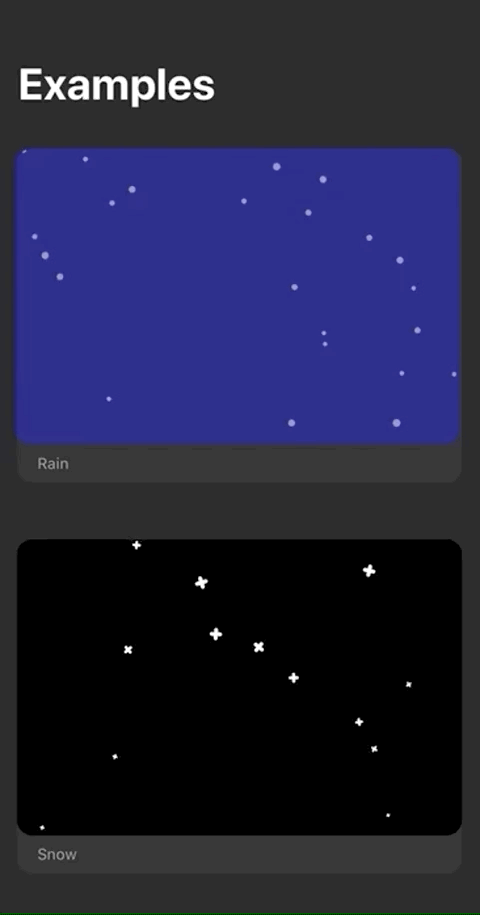
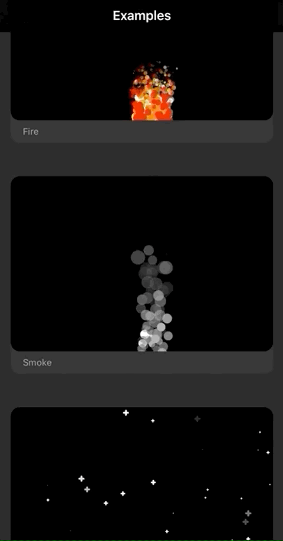

# SwiftUI-Particles
Playing with particles with SwiftUI ✨

## Screenshot/Preview

## References
Useful resources that I used for this small project:
* [CAEmitterLayer official documentation](https://developer.apple.com/documentation/quartzcore/caemitterlayer)
* [NSHipster's CAEmitterLayer Article](https://nshipster.com/caemitterlayer/)
