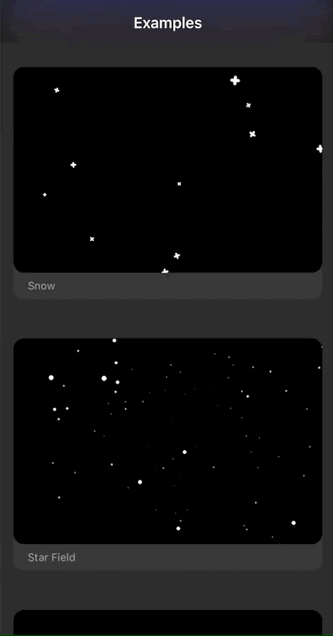

# SwiftUI-Particles
Playing with particles with SwiftUI ✨


## Screenshot/Preview

  


## How to use

Just use the the `ParticlesEmitter` class in your project as follow:

```swift
struct ContentView: View {
    var body: some View {
        ParticlesEmitter {
            EmitterCell()
                .content(.circle(1.0))
                .color(.white)
                .lifetime(20)
                .birthRate(5)
                .velocity(100)
                .scaleSpeed(-0.2)
                .yAcceleration(100)
        }
        .emitterSize(.init(width: 64, height: 8))
        .emitterShape(.rectangle)
    }
}
```

You can check out the example class in the project `ContentView.swift` for some emitter samples.

## References
Useful resources that I used for this small project:
* [CAEmitterLayer official documentation](https://developer.apple.com/documentation/quartzcore/caemitterlayer)
* [NSHipster's CAEmitterLayer Article](https://nshipster.com/caemitterlayer/)
